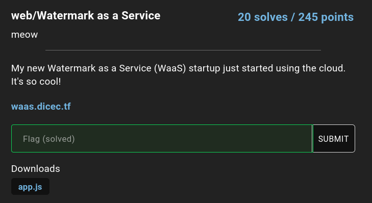
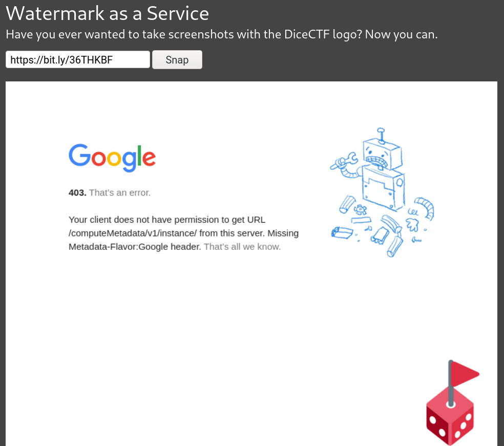
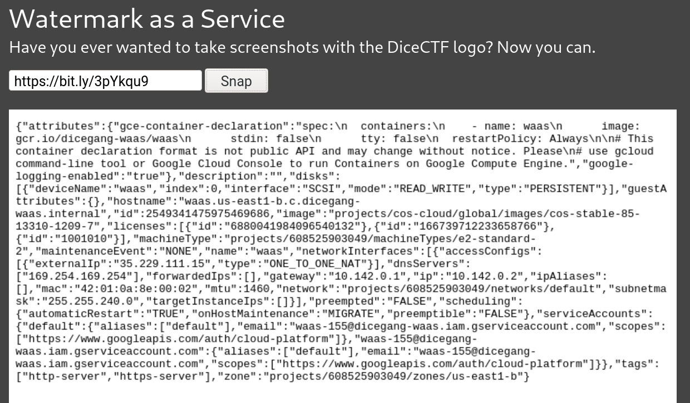
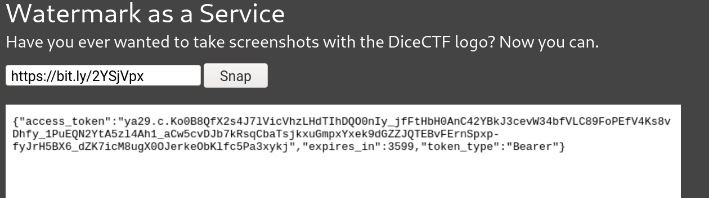
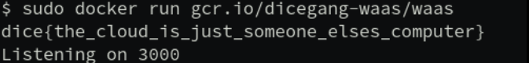

# Watermark as a Service (web, 245pts, 20 solves)

## Challenge Description



[app.js](./challenge/app.js)

## TL;DR

- SSRF with [bit.ly](https://bit.ly) bypass
- Google Cloud API Docker image leakage

## Writeup

The service running on [waas.dicec.tf](https://waas.dicec.tf) is a simple website snapshot app powered by puppeteer, a library for controlling a headless chrome. The source code has some protections to prevent the server from visiting the google metadata server. Our first step is to bypass the restrictions and visit it to collect credentials and metadata about the project on Google Cloud.

### SSRF

Using [dotless-decimal IP](https://en.wikipedia.org/wiki/IPv4#Address_representations) (For example, `http://192.0.2.235`  can be written as `http://3221226219`. A very rare format!) and [xip.io](http://xip.io) did not work because of the regex check and URL parser used in the source code. At last I managed to bypass the checking with [bit.ly](https://bit.ly), a URL shortening service. Basically, [bit.ly](https://bit.ly) returns a `HTTP 302 Found` and a Location Header, asking the client to go to the new location. With this trick, I was able to visit the metadata server.

Visiting  [http://metadata.google.internal/computeMetadata/v1/instance/](http://metadata.google.internal/computeMetadata/v1/instance/):



### Google Cloud API Leakage

Now that's some progress! But according to the docs we would need a `Metadata-Flavor: Google` header in order to access the server. It seems impossible to inject a header after reviewing the nodejs code. Luckily, there is still a legacy `v1beta1` api, and with that we could leak some very important infos:

1. http://metadata.google.internal/computeMetadata/v1beta1/instance/?recursive=true



2. http://metadata.google.internal/computeMetadata/v1beta1/instance/service-accounts/default/token?alt=json



Summary:

- There is a docker image hosted on Google Cloud at `gcr.io/dicegang-waas/waas`.
- We have the token for Authorization.

And that means we can pull the image from the Cloud with [docker auth](https://cloud.google.com/container-registry/docs/advanced-authentication)!

To extract the token, I have used `tesseract-ocr` to get a preliminary transcript of the token. It was able to recognize ~80% of the token accurately, but the rest had to be corrected by hand.

With the token, we can now pull the image:

```bash
$ docker login -u oauth2accesstoken -p "<token>" gcr.io
$ docker pull gcr.io/dicegang-waas/waas
```

And by running the image we got the flag!



flag: `dice{the_cloud_is_just_someone_elses_computer}`

## References

1. https://cloud.google.com/compute/docs/storing-retrieving-metadata
2. https://cloud.google.com/container-registry/docs/advanced-authentication
3. [tpc, Balsn CTF 2020](https://ctftime.org/writeup/24948)